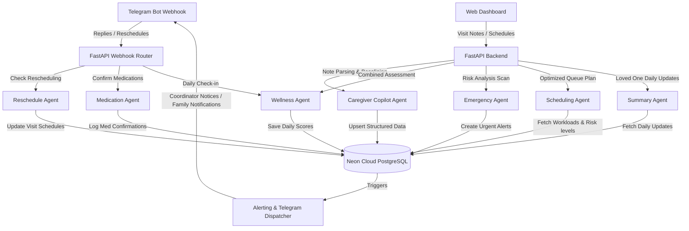

# Care Platform: Agentic Multi-Agent System & Feature Documentation

Welcome to the **Care Platform** system documentation. This document serves as a comprehensive guide to the architecture, multi-agent coordination, features, schemas, and API design of the platform.

---

## 1. High-Level System Architecture

The Care Platform is an AI-driven home care coordinator dashboard and automated patient alert system. The system runs on a **multi-agent orchestration model** powered by the **Google Antigravity (ADK) SDK** and the **Google Gemini API**. 

The system leverages a centralized routing orchestrator along with specialized sub-agents. It connects caregivers, patients, family members, and medical administrators through a unified interface.



---

## 2. Directory of Specialist Agents

The core intelligence of the system is split across **8 distinct agents** implemented with Google's ADK. Each agent is modeled with clinical and administrative reasoning, utilizing structured response formats (Pydantic models) and tools.

| Agent Name | Model | Function | Context Inputs | Key Outputs / Schema |
| :--- | :--- | :--- | :--- | :--- |
| **Root Orchestrator** | `gemini-2.5-flash-lite` | Central dispatch routing | Natural language requests | Routes user intent to specialist sub-agents |
| **Caregiver Copilot** | `gemini-2.5-flash-lite` | Parses unstructured clinical visit notes | Unstructured note text + patient baselines | `visit_summary`, `vitals` dict, `risk_level`, `risk_flags` |
| **Wellness Agent** | `gemini-flash-latest` | Generates wellness scores (1-10) and logs | Subjective patient Telegram response + clinical notes | `mood`, `pain`, `eating`, `sleep`, `wellness_score`, `needs_escalation` |
| **Medication Agent** | `gemini-flash-lite-latest` | Parses unstructured medication replies | Text message + active patient medications | `medications` array (confirmed/missed/flagged status), `reply` |
| **Scheduling Agent** | `gemini-flash-lite-latest` | Matches patients to coordinators | Patient metrics + coordinator capacities | `visits` plan array, `coordinator_workload` list |
| **Emergency Agent** | `gemini-flash-lite-latest` | Continuous patient risk scanning | Adherence logs + wellness trends + text replies | `risk_level`, `needs_immediate_escalation`, notifications |
| **Summary Agent** | `gemini-flash-lite-latest` | Reassuring updates for loved ones | Daily med logs + wellness + visit summary | Natural conversational plain text |
| **Reschedule Agent** | `gemini-flash-lite-latest` | Processes patient postponement requests | Patient text + current schedule time/date | `is_reschedule_request`, `requested_time`, `requested_date`, `reply` |

---

### Agent Deep-Dives

#### 2.1 Root Orchestrator Agent (`root_agent.py`)
* **Function**: Acts as the central router for system-wide requests, delegating queries to the appropriate specialist agent without requiring user intervention.
* **Why it is used**: Rather than forcing separate interfaces, the root agent processes text and routes it to the specific specialist sub-agent (e.g. routing a visitor's note to Copilot, a medication check-in to Medication Agent).
* **How it is used**: Root agent is initialized with references to all 6 primary sub-agents (`medication_agent`, `summary_agent`, `wellness_agent`, `emergency_agent`, `scheduling_agent`, `copilot_agent`).

#### 2.2 Caregiver Copilot Agent (`copilot_agent.py`)
* **Function**: Translates unstructured visit notes (either typed or voice-transcribed by a care coordinator on-site) into a structured clinical record.
* **Why it is used**: Care coordinators often check on patients and jot down brief notes. This agent extracts vital signs, details of medications administered, environmental observations, and clinical risk factors.
* **How it is used**: Invoked via `POST /api/copilot/note/{patient_id}`.
* **Context**: It reads patient baseline conditions (e.g. normal Blood Pressure range, existing chronic conditions like diabetes or COPD) to contextually evaluate whether the current vitals are normal for *this specific patient* or represent a new concern.
* **Tools Used**:
  * `extract_vitals(note_text)`: Identifies BP, oxygen, pulse, sugar, temperature.
  * `extract_medications_given(note_text)`: Identifies administered medications.
  * `assess_visit_risks(note_text, baseline_bp, conditions, recent_concerns)`: Compares vitals and notes against historical context.
* **Output Schema**: Returns a JSON object with structured fields like `vitals`, `observations`, `risk_level` (`none`, `low`, `medium`, `high`), and `coordinator_note_quality` (`complete`, `partial`, `minimal`).

#### 2.3 Wellness Agent (`wellness_agent.py`)
* **Function**: Tracks subjective patient well-being and updates the daily database logs.
* **Why it is used**: Evaluates how the patient feels daily across four dimensions (mood, pain, eating, sleep) and determines a unified wellness score (1 to 10).
* **How it is used**: 
  * *Mode 1 (Patient Only)*: Invoked via Telegram webhook when a patient responds to their morning wellness prompt.
  * *Mode 2 (Combined)*: Invoked after a care coordinator submits a visit note. It combines the patient's subjective Telegram words with the coordinator's objective observations. If they conflict (e.g., patient says "I feel fine" but coordinator notes "patient is grimacing in pain"), it trusts the worse signal, files a concern, and sets the wellness score accordingly.
* **Output Schema**: `WellnessAgentResponse` containing dimensions, `wellness_score`, `needs_escalation` (boolean), and a supportive `reply` matched to the patient's language (English, Arabic, or Malayalam).

#### 2.4 Medication Agent (`medication_agent.py`)
* **Function**: Interprets unstructured text messages sent by patients in response to medication reminders.
* **Why it is used**: Elderly patients rarely text in precise commands. If sent a reminder, they might say "I took the white pill but skipped the red one because my stomach hurt." This agent parses such text into structured logs.
* **How it is used**: Invoked during the Telegram incoming message webhook workflow.
* **Context**: Passed the text message and the list of scheduled medications for that slot.
* **Adherence States**:
  * `confirmed`: The patient explicitly states they took the medication.
  * `missed`: The patient skipped, refused, or forgot the medication.
  * `flagged`: Taken, but with associated negative symptoms or complaints (recorded in the `concern` column).
  * `unclear`: The message is ambiguous.
* **Output Schema**: `MedicationAgentResponse` with a list of parsed medication statuses and a warm response in the patient's language.

#### 2.5 Scheduling Agent (`scheduling_agent.py`)
* **Function**: Generates an optimized, prioritized daily care visit schedule for coordinators.
* **Why it is used**: Ensures that high-risk or deteriorating patients are visited first, while optimizing coordinator caseload capacity.
* **How it is used**: Triggered via `POST /api/scheduling/generate`.
* **Context**: Consumes all patient indicators (days since last visit, visit frequency target, consecutive missed medications, latest wellness score, latest coordinator risk level, and open alerts) and maps them against coordinator availability.
* **Tools Used**:
  * `evaluate_patient_visit_priority(...)`: Calculates urgency rating (`urgent`, `high`, `medium`, `low`).
  * `evaluate_coordinator_capacity(...)`: Inspects assigned patients, remaining slots (maximum 5 visits per day), and active status.
  * `suggest_visit_time_slot(...)`: Assigns optimal morning/afternoon slots based on patient priority.
* **Output Schema**: `SchedulingAgentResponse` with a structured list of visit items, unassigned reasons (if a coordinator is overloaded), workloads, and a plan summary.

#### 2.6 Emergency Agent (`emergency_agent.py`)
* **Function**: Conducts complex multi-channel risk assessments.
* **Why it is used**: Scans for complex emergency states that rules-based engines miss, such as a moderate drop in wellness scores combined with missed check-ins and subtle phrases in messages indicating confusion or injury.
* **How it is used**: Triggered via `POST /api/emergency/scan` (system-wide daily scan) or individual requests.
* **Context**: Receives the patient's recent messages, medication logs, and historical wellness logs.
* **Tools Used**:
  * `analyse_medication_pattern(...)`: Calculates missed ratios and trends.
  * `analyse_wellness_pattern(...)`: Computes sudden wellness score drops (e.g. 4+ points) and missing check-ins.
  * `check_severe_keywords(...)`: Scans text for critical indicators (chest pain, falls, breathing issues, help) in English, Arabic, and Malayalam.
* **Output Schema**: `EmergencyAgentResponse` including `risk_level` (`none` to `critical`), `risk_score` (1-10), alerts, recommended care team actions, and tailored messages for coordinators, family contacts, and patients.

#### 2.7 Summary Agent (`summary_agent.py`)
* **Function**: Generates non-clinical daily summaries to reassure family members.
* **Why it is used**: Family members want to know how their relative is doing without being overwhelmed by clinical terms.
* **How it is used**: Triggered nightly via `POST /api/summaries/generate` or via the family section of the dashboard.
* **Context**: Receives the patient's daily medication log history, wellness dimensions, and coordinator notes.
* **Output Schema**: Directly outputs plain, warm, comforting text reassuring the family of what went well (e.g., "Dad ate well and took his morning medications. He mentioned a bit of back pain, but his coordinator visited and noted his vitals are completely stable.")

#### 2.8 Reschedule Agent (`reschedule_agent.py`)
* **Function**: Classifies and handles visit rescheduling requests from patients.
* **Why it is used**: Patients frequently request schedule changes via Telegram ("Can the nurse come at 3 PM instead of 10 AM?").
* **How it is used**: Intercepts Telegram incoming messages prior to medication logging.
* **Context**: Receives patient's message, the assigned coordinator, and the current scheduled visit time/date.
* **Output Schema**: `RescheduleInterpretation` indicating if it is a rescheduling request, extracting the `requested_time` (HH:MM), `requested_date` (YYYY-MM-DD or tomorrow), `reason`, and a supportive response.

---

## 3. How the Agents Interact

The agents are designed to work together, feeding data into a shared PostgreSQL state database, which triggers subsequent agent workflows.

```
                  ┌────────────────────────────────────────┐
                  │          Caregiver Copilot             │
                  │   - Process coordinator visit notes    │
                  └───────────────────┬────────────────────┘
                                      │
                                      ▼ [Writes Vitals, Risk Level & Observations]
                                      │
┌────────────────────────┐            ▼            ┌────────────────────────┐
│  Patient Telegram Msg  ├────────────────────────>│     Wellness Agent     │
│   - Subjective state   │                         │   - Unified Daily Log  │
└────────────────────────┘                         └──────────┬─────────────┘
                                                              │
                                  ┌───────────────────────────┴───────────────────────────┐
                                  ▼ [Writes Wellness Log & Escalation Flag]               ▼ [Writes Daily Summary Data]
                                  │                                                       │
┌────────────────────────┐        ▼                                                       ▼
│    Medication Agent    ├───────────────> [Neon Cloud Database] ◄──────────────── Medication Logs
│   - Adherence Parsing  │                         │
└────────────────────────┘                         │ [Consumes All Daily Updates]
                                                   ▼
                                      ┌────────────────────────┐
                                      │    Emergency Agent     │
                                      │   - Alert Generation   │
                                      └────────────┬───────────┘
                                                   │
                                   ┌───────────────┴───────────────┐
                                   ▼ [Flags Risk Level]            ▼ [Generates Text]
                                   │                               │
                      ┌────────────┴───────────┐      ┌────────────┴───────────┐
                      │    Scheduling Agent    │      │     Summary Agent      │
                      │   - Priority Visit     │      │   - Daily Family       │
                      │     Arrangements       │      │     Reassurance        │
                      └────────────────────────┘      └────────────────────────┘
```

1. **Information Enrichment (Copilot to Wellness)**:
   When a coordinator documents a visit, the `Copilot Agent` outputs structured vitals and risk levels. The backend automatically forwards this to the `Wellness Agent`, which merges it with any Telegram check-in replies. The `Wellness Agent` then outputs a unified wellness score.
2. **Alert Orchestration (Wellness/Medication to Emergency)**:
   As the `Medication Agent` and `Wellness Agent` log patient updates, the `Emergency Agent` scans the database to analyze adherence rates, wellness drops, and keyword detections, generating alarms as needed.
3. **Operational Optimization (Emergency to Scheduling)**:
   The `Emergency Agent` updates the patient's `latest_risk_level` in the database. The `Scheduling Agent` reads this risk level to prioritize urgent visits, assigning slot times and workloads accordingly.
4. **Reassurance Communication (Database to Summary)**:
   The `Summary Agent` consumes all database logs for the day (medication logs, wellness scores, and coordinator notes) to compose family updates.

---

## 4. Robustness & Retry Layer

Due to high demand or rate limits, the Gemini API may return temporary `503 Unavailable` or `429 Rate Limit` errors. To prevent system failures, the Care Platform implements a robust, asynchronous **progressive exponential backoff retry layer** in [gemini_service.py](file:///home/alan/Documents/ADK_care-platform/care-platform/backend/app/services/gemini_service.py).

```python
for attempt in range(max_retries):
    try:
        response = await client.aio.models.generate_content(
            model=model,
            contents=prompt,
            config=config,
        )
        return json.loads(response.text) # or return text
    except Exception as e:
        err_str = str(e)
        is_temporary = (
            "503" in err_str or 
            "429" in err_str or 
            "unavailable" in err_str.lower() or 
            "rate" in err_str.lower() or
            "overloaded" in err_str.lower()
        )
        if is_temporary and attempt < max_retries - 1:
            delay = base_delay * (2.5 ** attempt) # Delays: 1.0s, 2.5s, 6.25s, 15.6s
            await asyncio.sleep(delay)
            continue
        raise e
```

If an agent fails permanently after 4 retries, the platform defaults gracefully:
* The frontend displays a **"Failed to Process"** notice.
* Safe default schemas are stored in the database (e.g. status marked as `"unclear"`, `wellness_score` set to `None`, and notification text instructing the coordinator to review the case manually) to prevent data loss.

---

## 5. Key Functions & Features

### 5.1 Multi-Language Telegram Interface
* **Patient Reminders**: Interactive, batched medication reminders sent via Telegram based on patient schedules. Patients can confirm using inline buttons (`Took It` / `Missed`) or reply in natural language.
* **Daily Wellness Check-in**: Sent every morning at 9:00 AM. Inquires about mood, pain, eating, and sleep.
* **Multi-Language Reasoning**: Full native translation support for **English**, **Arabic (ar)**, and **Malayalam (ml)**. Reminders are dispatched in the patient's preferred language, and the agents interpret replies in all three languages.

### 5.2 Caregiver Copilot & Note Processor
* **Structured Clinical Extraction**: Automatically parses voice-to-text transcripts or typed notes into structured medical records.
* **Vital Sign Baselining**: Detects if vital signs (blood pressure, temperature, oxygen saturation) deviate significantly from the patient's baseline metrics.
* **Note Quality Scoring**: Rates note details as `complete`, `partial`, or `minimal` to encourage thorough documentation.

### 5.3 Automated Scheduling & Workload Dispatch
* **Urgency-based Queuing**: Prioritizes patients overdue for visits or displaying high clinical risk.
* **Workload Cap Management**: Ensures no coordinator is assigned more than 5 visits per day. Overflows are flagged for administrative reallocation.
* **Time Slot Optimization**: Places critical visits in early morning slots and routine checks in afternoon slots.

### 5.4 Daily Family Summary Generator
* **Automatic nightly summaries**: Generates reassuring updates for family members.
* **Friendly Translation**: Converts complex clinical observations and medication log data into comforting, everyday language.

### 5.5 Interactive Web Dashboard
* **Patient Records**: A unified panel to view medical conditions, timezone settings, and medication schedules.
* **Real-time Alert Center**: A dashboard for care coordinators to view, acknowledge, and resolve alerts generated by patients.
* **Wellness & Medication Logs**: Dynamic charts visualizing daily wellness trends and medication adherence.
* **Responsiveness**: Fully optimized for mobile devices, adapting the layout for touch targets and converting side navigation into a responsive top bar.
* **Theme System**: Premium dark and light theme options, defaulting to a clean light theme on startup.

---

## 6. Database Models & Schema Design (Neon PostgreSQL)

The backend utilizes PostgreSQL (hosted on a Neon database instance) with the following SQLAlchemy models:

### 6.1 User (`users` table)
Represents care coordinators and administrators.
* `id` (UUID): Primary Key.
* `name` (String): Coordinator's full name.
* `role` (Enum): `coordinator` or `doctor`.
* `telegram_chat_id` (BigInteger): Custom telegram ID for receiving alert notifications.
* `active` (Boolean): Status indicator.

### 6.2 Patient (`patients` table)
Holds patient profiles, settings, and medical baselines.
* `id` (UUID): Primary Key.
* `name` (String): Patient's name.
* `phone` (String): Mobile contact.
* `language` (Enum): `en`, `ar`, or `ml`.
* `coordinator_id` (UUID): Reference to the assigned coordinator.
* `telegram_chat_id` (BigInteger): Custom Telegram ID for reminders.
* `clinical_conditions` (Text): Diagnoses and histories.
* `baseline_bp` (String): Normal blood pressure reading (e.g. `120/80`).
* `timezone` (String): Timezone for reminder scheduling (e.g., `Asia/Kolkata`).

### 6.3 Medication (`medications` table)
Scheduled medications for each patient.
* `id` (UUID): Primary Key.
* `patient_id` (UUID): Foreign key to the patient.
* `name` (String): Name of the medicine.
* `dosage` (String): Dosage (e.g., `500mg`).
* `times` (StringArray): Times scheduled (e.g., `["09:00", "21:00"]`).

### 6.4 Medication Log (`medication_logs` table)
Logs medication adherence states.
* `id` (UUID): Primary Key.
* `patient_id` (UUID), `medication_id` (UUID): Foreign Keys.
* `scheduled_time` (DateTime): Naive UTC time.
* `confirmed_at` (DateTime): Actual response timestamp.
* `status` (Enum): `pending`, `confirmed`, `missed`, `flagged`.
* `patient_reply` (Text): The raw text response from the patient.
* `ai_interpretation` (Text): Structured JSON returned by the Medication Agent.

### 6.5 Alert (`alerts` table)
Critical alerts requiring caregiver attention.
* `id` (UUID): Primary Key.
* `patient_id` (UUID): Foreign Key.
* `type` (Enum): `missed_medication`, `no_response`, `flagged`.
* `severity` (Enum): `low`, `medium`, `high`, `critical`.
* `message` (Text): Alert message text.
* `status` (Enum): `open`, `acknowledged`, `resolved`.

### 6.6 Family Contact (`family_contacts` table)
Stores patient family members.
* `id` (UUID): Primary Key.
* `patient_id` (UUID): Foreign Key.
* `name` (String): Name of family member.
* `relation` (String): Relationship description (e.g. Daughter, Son).
* `telegram_chat_id` (BigInteger): Telegram ID for receiving daily summaries and alerts.

### 6.7 ADK Session State Tables
* `ADKSessionModel` (`adk_sessions` table): Stores conversational context and message logs.
* `ADKAppStateModel` (`adk_app_states` table) & `ADKUserStateModel` (`adk_user_states` table): Persist global and user settings for ADK runners.

---

## 7. Background Orchestration (n8n Workflow)

To automate scheduled routines without resource-heavy polling loops, the system integrates a scheduled background n8n workflow:

* **Every 10 Minutes**: Triggers `POST /api/reminders/send-due` (logs due medications and sends Telegram messages) and `POST /api/reminders/check-missed` (flags reminders unanswered after 30 minutes, marking them as `missed` and alerting coordinators).
* **Daily at 9:00 AM (Patient Time)**: Triggers `POST /api/wellness/send-checkins` to dispatch daily wellness questions.
* **Daily at 8:00 PM (Family Time)**: Triggers `POST /api/summaries/generate` to build daily summaries and send them to family contacts.
